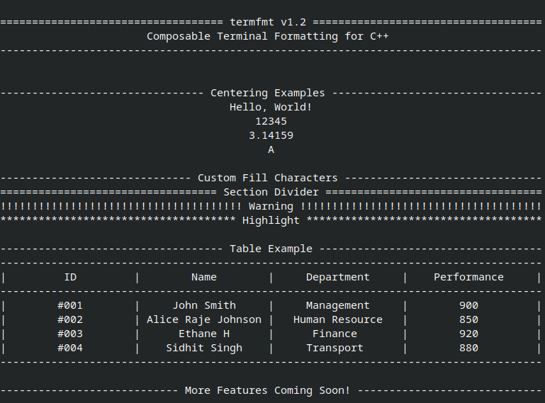

# 🚀 termfmt

> Composable terminal formatting for C++ (header-only)

---

## 📘 Overview

`termfmt` is a lightweight C++ library that makes terminal output **predictable, readable, and composable**.

It replaces stateful `iostream` formatting (`setw`, `setfill`, etc.) with **value-based formatting primitives** like:

```cpp
center("Hello", 20, '-')
line(50)
```

---

## ⚡ Why `termfmt`?

Standard C++ formatting is **stateful and fragile**:

```cpp
std::cout << std::setw(20) << std::setfill('-') << "Hello";
```

- Order-dependent  
- Hard to read  
- State leaks across operations  

---

### termfmt

```cpp
std::cout << center("Hello", 20, '-');
```

- No hidden state  
- Each piece is independent  
- Easy to compose  

---

## 📸 Output Preview

<p align="center">
  
</p>

## 🧪 Example

```cpp
#include <iostream>
#include <termfmt.hpp>

int main() {
    using termfmt::center;
    using termfmt::line;
    using termfmt::table;

    std::cout << center("termfmt v1.2", 60, '=') << '\n';
    std::cout << center("Composable Terminal Formatting", 60) << '\n';
    std::cout << line(60) << '\n';

    table t(3, 20);
    t.header({"ID", "Name", "Score"});

    t.add_row(1, "John Smith", 900);
    t.add_row(2, "Alice Johnson", 850);

    t.print();
}
```

### Output

```
========================= termfmt v1.2 =========================
               Composable Terminal Formatting               
----------------------------------------------------------------

----------------------------------------------------------------
|         ID         |        Name        |       Score        |
----------------------------------------------------------------
|         1          |     John Smith     |        900         |
|         2          |   Alice Johnson    |        850         |
----------------------------------------------------------------
```

---
## ✨ Features

- `center(value, width, fill = ' ')`
- `line(width, fill = '-')`
- `table(columns, width)`
- Supports **mixed data types** (int, double, string, char, etc.)
- Header-only — no build system required

---

## 📚 API

### `center(value, width, fill = ' ')`

Centers any printable value.

```cpp
center("Hello", 20);
center(123, 20);
center(3.14, 20, '-');
```

---

### `line(width, fill = '-')`

Draws a horizontal separator.

```cpp
line(50);
line(50, '=');
```

---

### `table(columns, width)`

Simple table rendering.

```cpp
table t(3, 20);

t.header({"ID", "Name", "Score"});
t.add_row(1, "John", 95);
t.add_row(2, "Alice", 88);

t.print();
```

Supports **mixed data types** via variadic templates.

---

## 📦 Installation

The library is header-only. Just include it:

```cpp
#include <termfmt.hpp>
```

Compile with:

```bash
g++ main.cpp -Iinclude -o app
```

---

## 🧠 Design

`termfmt` uses **value-based formatting**, not stream state.

Each formatting unit:
- is self-contained  
- does one thing  
- composes cleanly  

---

## 🤝 Contributing

Contributions are welcome!

---

## 👤 Author

Built with ❤️ by **Akshit Kumar**  
🔗 https://github.com/akshitkumar0

---

## 📜 License

MIT
